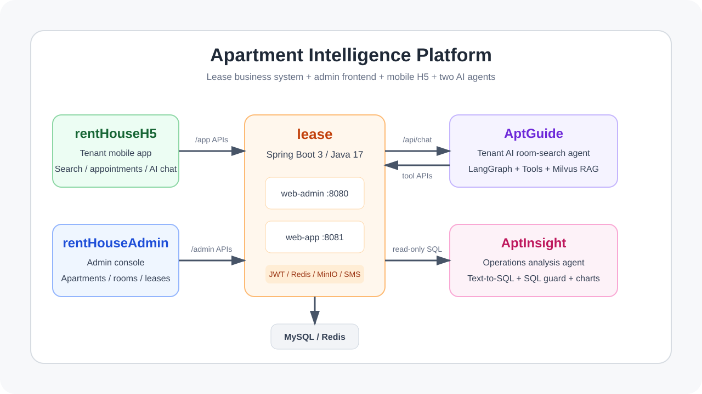
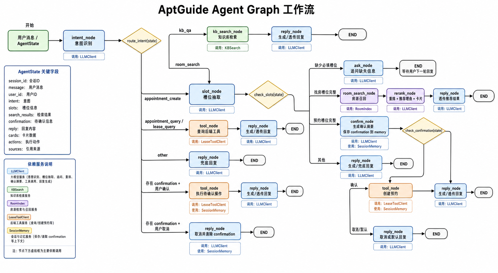

# Apartment Intelligence Platform

> 公寓租赁业务系统 + 管理后台 + 租客 H5 + 双智能体应用的一体化工程。



## 项目简介

`apartment-intelligence-platform` 是一个单仓库多项目平台，围绕公寓租赁业务构建完整的前后端和 AI 能力：

- `lease`：租赁业务后端，提供后台管理 API、租客端 API、AI 工具接口和统一数据访问。
- `rentHouseAdmin`：运营 / 管理员使用的 Vue3 后台管理系统。
- `rentHouseH5`：租客使用的移动端 H5，覆盖找房、预约、租约、个人中心和 AI 助手入口。
- `AptGuide`：面向租客的智能找房助手，负责自然语言找房、规则问答、预约确认和工具调用。
- `AptInsight`：面向运营人员的智能分析助手，负责自然语言经营分析、Text-to-SQL、图表和总结。

平台目标不是只做一个租房 CRUD 系统，而是在真实租赁业务链路中接入两个不同角色的 AI Agent：租客侧提升找房和咨询效率，运营侧提升数据分析和决策效率。

## 项目结构

```text
.
├── AptGuide/                 # C 端智能找房助手，FastAPI + LangGraph + Tool Calling + Milvus
├── AptInsight/               # B 端智能运营分析助手，FastAPI + LangGraph + Text-to-SQL
├── AptInsight文档/            # AptInsight 最终测试、测评等补充文档
├── docs/                     # 根项目图片与补充资料
├── lease/                    # Spring Boot 租赁后端，多模块 Maven 工程
├── rentHouseAdmin/           # Vue3 + Element Plus 后台管理前端
├── rentHouseH5/              # Vue3 + Vant 租客移动端 H5
└── aptguide-agent-graph-flowchart.png
```

## 子系统总览

| 子系统 | 使用对象 | 技术栈 | 默认端口 | 核心职责 |
| --- | --- | --- | --- | --- |
| `lease/web-admin` | 管理员 / 运营 | Spring Boot 3、Java 17、MyBatis-Plus、Redis、MinIO | `8080` | 公寓、房间、属性、预约、租约、用户、岗位等后台 API |
| `lease/web-app` | 租客 / H5 / AI 工具 | Spring Boot 3、Java 17、MyBatis-Plus、JWT、Redis、短信 | `8081` | 租客登录、找房、预约、租约、浏览历史、AI 转发与内部工具接口 |
| `rentHouseAdmin` | 管理员 / 运营 | Vue3、Vite、TypeScript、Pinia、Element Plus、ECharts | Vite 默认 | 后台管理 UI、权限菜单、主题、表格、房源与租约管理 |
| `rentHouseH5` | 租客 | Vue3、Vite、TypeScript、Pinia、Vant、Axios | Vite 默认 | 移动端找房、房源详情、预约、我的租约、个人中心、AI 助手 |
| `AptGuide` | 租客 | Python 3.12、FastAPI、LangGraph、OpenAI 兼容模型、Milvus | `8100` | 智能找房、需求补全、RAG 规则问答、预约确认、Java 工具调用 |
| `AptInsight` | 运营 / 管理员 | Python 3.12、FastAPI、LangGraph、SQLAlchemy、sqlglot | `8000` | 自然语言分析、只读 SQL 生成、SQL 安全守卫、表格图表与运营总结 |

## 核心业务能力

### 租赁业务后端 `lease`

`lease` 是平台的数据和业务中心，采用 Maven 多模块结构：

```text
lease/
├── common/      # 通用组件：JWT、Redis、MinIO、验证码、短信、Web 基础能力
├── model/       # 实体、枚举、基础模型
└── web/
    ├── web-admin/  # 后台管理服务，/admin/*
    └── web-app/    # 租客端服务，/app/* 与 /internal/ai/tools/*
```

后台管理端主要接口覆盖：

- `/admin/login/*`：管理员登录、验证码、当前用户信息。
- `/admin/apartment/*`、`/admin/room/*`：公寓与房间管理。
- `/admin/attr/*`、`/admin/fee/*`、`/admin/facility/*`、`/admin/label/*`：基础属性、费用、配套、标签管理。
- `/admin/appointment/*`、`/admin/agreement/*`：看房预约与租约管理。
- `/admin/system/user/*`、`/admin/system/post/*`：后台账号、岗位和状态管理。

租客端主要接口覆盖：

- `/app/login`、`/app/login/getCode`、`/app/info`：短信登录和用户信息。
- `/app/room/pageItem`、`/app/room/getDetailById`：房源列表与详情。
- `/app/apartment/getDetailById`：公寓详情。
- `/app/appointment/*`：看房预约提交、列表、详情。
- `/app/agreement/*`：我的租约、详情、签约状态更新。
- `/app/history/pageItem`：浏览历史。
- `/app/ai/chat`：H5 调用 AI 助手的统一入口。
- `/internal/ai/tools/*`：AptGuide 调用的内部工具接口，包含房源搜索、创建预约、我的预约、我的租约和健康检查。

### 管理后台 `rentHouseAdmin`

后台前端采用 Vue3 + TypeScript + Element Plus，路由已覆盖实际管理页面：

- 首页工作台。
- 系统用户管理、岗位管理。
- 公寓管理、房间管理、属性管理。
- 看房预约管理、租约管理。
- 租客用户管理。

工程内封装了 Axios 请求、Pinia 状态、ProTable、SearchForm、上传组件、主题切换、暗黑模式和菜单权限能力，适合后台高频表格与表单维护场景。

### 租客 H5 `rentHouseH5`

H5 端采用 Vue3 + Vant，页面围绕租客完整链路组织：

- `找房`：搜索、筛选、房源 / 公寓卡片。
- `房源详情` / `公寓详情`：展示房间、价格、租期、支付方式、配套与地图相关信息。
- `预约看房`：租客提交或查看预约信息。
- `我的房间`、`我的租约`、`我的预约`、`浏览历史`。
- `消息`、`圈子`、`个人中心`。
- `AiAssistant`、`ChatMessage`：H5 内置 AI 对话组件，通过 `src/api/ai` 接入后端 `/app/ai/chat`。

### 智能找房助手 `AptGuide`

`AptGuide` 是 C 端 Agent，不直连 MySQL，所有业务数据通过 `lease` 内部工具接口获取。它的核心链路是：



主要能力：

- 自然语言找房：解析预算、区域、租期、付款方式和模糊偏好。
- 语义召回：使用 Milvus 做房源语义检索和租房规则知识库 RAG。
- 工具调用：通过 Java 内部接口做精确过滤、预约创建、个人预约 / 租约查询。
- 多轮补全：信息不足时主动追问，沿用上下文继续推荐。
- 写操作确认：预约等写操作必须先生成待确认状态，再由用户确认执行。
- 浏览器独立聊天 UI：第一阶段可独立运行验证。

### 智能运营分析助手 `AptInsight`

`AptInsight` 是 B 端分析 Agent，面向运营人员把自然语言问题转换为安全只读 SQL，并返回结果表、图表和总结。

已实现能力包括：

- FastAPI `/api/chat` 分析接口和 `/health` 健康检查。
- LangGraph 工作流：意图识别、SQL 生成、SQL 守卫、查询执行、图表构建、答案生成。
- sqlglot AST 级 SQL 守卫：仅允许 SELECT、表列白名单、多语句拒绝、敏感字段拦截。
- 只读 MySQL 执行器、结果脱敏、JSON 日志和 trace_id。
- Agent Eval Harness：当前 README 所载子项目状态为 40 个用例 87.5% 通过，安全用例 100% 通过。

## AI 集成链路

```text
租客
  ↓
rentHouseH5 / AiAssistant
  ↓ POST /app/ai/chat
lease web-app
  ↓ 内部 token 转发
AptGuide /api/chat
  ├─ Milvus：房源语义召回、租房规则 RAG
  ├─ LangGraph：意图、槽位、工具、确认、回复
  └─ lease /internal/ai/tools/*：房源过滤、预约、租约、个人数据
        ↓
      MySQL
```

```text
运营人员
  ↓
AptInsight /api/chat
  ├─ LangGraph：问题理解、SQL 生成、结果解释
  ├─ sqlglot：只读 SQL 安全守卫
  └─ MySQL：租赁业务数据只读查询
```

## 环境要求

- JDK 17+
- Maven 3.8+
- Node.js 16+
- npm / pnpm
- Python 3.12+
- `uv`
- MySQL 8.x
- Redis
- MinIO（后台图片 / 文件上传）
- Milvus 2.4（AptGuide 语义检索）
- OpenAI 兼容 LLM 服务（项目默认按 Qwen / DashScope、MiMo 等兼容接口封装）

## 快速启动

### 1. 启动后端管理服务

```bash
cd lease
mvn clean install
mvn -pl web/web-admin spring-boot:run
```

默认端口：`http://localhost:8080`

常用环境变量：

```bash
MYSQL_URL=jdbc:mysql://127.0.0.1:3306/lease?useUnicode=true&characterEncoding=utf-8&useSSL=false&allowPublicKeyRetrieval=true&serverTimezone=GMT%2b8
MYSQL_USERNAME=root
MYSQL_PASSWORD=change-me
REDIS_HOST=127.0.0.1
REDIS_PORT=6379
MINIO_ENDPOINT=http://127.0.0.1:9000
MINIO_ACCESS_KEY=change-me
MINIO_SECRET_KEY=change-me
MINIO_BUCKET_NAME=lease
```

### 2. 启动租客端后端服务

```bash
cd lease
mvn -pl web/web-app spring-boot:run
```

默认端口：`http://localhost:8081`

AI 相关环境变量：

```bash
APTGUIDE_URL=http://localhost:8100
AI_INTERNAL_TOKEN=aptguide-internal-token-2026
ALIYUN_SMS_ACCESS_KEY_ID=change-me
ALIYUN_SMS_ACCESS_KEY_SECRET=change-me
```

### 3. 启动管理后台

```bash
cd rentHouseAdmin
npm install
npm run dev
```

### 4. 启动租客 H5

```bash
cd rentHouseH5
npm install
npm run dev
```

### 5. 启动 AptGuide

```bash
cd AptGuide
uv sync
cp .env.example .env
make seed-kb
make sync-vectors
make dev
```

默认端口：`http://localhost:8100`

### 6. 启动 AptInsight

```bash
cd AptInsight
uv sync
cp .env.example .env
make run
```

默认端口：`http://localhost:8000`

## 常用命令

| 模块 | 命令 | 说明 |
| --- | --- | --- |
| `lease` | `mvn clean install` | 编译 Java 多模块工程 |
| `lease/web-admin` | `mvn -pl web/web-admin spring-boot:run` | 启动后台 API |
| `lease/web-app` | `mvn -pl web/web-app spring-boot:run` | 启动租客端 API |
| `rentHouseAdmin` | `npm run dev` | 启动管理后台开发服务器 |
| `rentHouseAdmin` | `npm run build` | 构建管理后台 |
| `rentHouseH5` | `npm run dev` | 启动 H5 开发服务器 |
| `rentHouseH5` | `npm run build` | 构建 H5 |
| `AptGuide` | `make test` / `make lint` | 测试与 Ruff 检查 |
| `AptGuide` | `make dev` | 启动智能找房助手 |
| `AptInsight` | `make test` / `make lint` / `make eval` | 测试、检查与评测 |
| `AptInsight` | `make run` | 启动智能运营分析助手 |

## 数据与配置

仓库中包含用于开发和评测的 SQL 与数据资料：

- `AptInsight/scripts/seed_data_2025.sql`
- `AptInsight/scripts/seed_data_guangzhou_2026.sql`
- `AptInsight/backups/least_backup_20250502.sql`

注意：`web-app` 当前默认配置里数据库名为 `least`，`web-admin` 默认配置里数据库名为 `lease`。本地联调前请统一 `MYSQL_URL`，避免两个 Java 服务连接到不同库。

## 安全设计

- 管理端和租客端分别使用 `/admin/*` 与 `/app/*` API 边界。
- 租客个人数据按登录用户身份过滤，AI 不直接访问 MySQL。
- `AptGuide` 写操作必须二次确认，内部工具接口通过 `AI_INTERNAL_TOKEN` 保护。
- `AptInsight` 使用只读 SQL、表列白名单、敏感字段拦截和结果脱敏。
- MinIO、短信、LLM、数据库密钥均应通过环境变量提供，不应写入仓库。

## 文档索引

- [Agent Evaluation Resume Strategy](docs/agent-evaluation-resume-strategy.md)
- [Agent Evaluation Portfolio Report](docs/agent-evaluation-portfolio-report-2026-05-07.md)
- [AptGuide README](AptGuide/README.md)
- [AptInsight README](AptInsight/README.md)
- [AptGuide 架构文档](AptGuide/AptGuide文档/03-技术架构与模块设计.md)
- [AptInsight 架构文档](AptInsight/AptInsight文档/03-技术架构与模块设计.md)
- [AptInsight API 文档](AptInsight/docs/api/README.md)
- [AptInsight 安全文档](AptInsight/docs/security/README.md)
- [rentHouseAdmin README](rentHouseAdmin/README.md)
- [rentHouseH5 README](rentHouseH5/README.md)

## 当前状态

该仓库已经具备“租赁业务系统 + 两端前端 + 双 Agent”的主体结构：

- 传统租赁业务链路由 `lease`、`rentHouseAdmin`、`rentHouseH5` 承载。
- C 端智能找房由 `AptGuide` 承载，并通过 `lease web-app` 内部工具接口与真实业务数据衔接。
- B 端智能分析由 `AptInsight` 承载，并通过只读 SQL 安全链路分析租赁经营数据。

后续重点通常是统一环境配置、完善端到端联调脚本、补齐 H5 与管理后台截图、把 AI 评测纳入持续集成。
