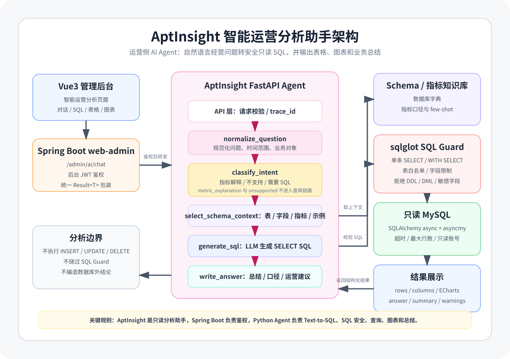
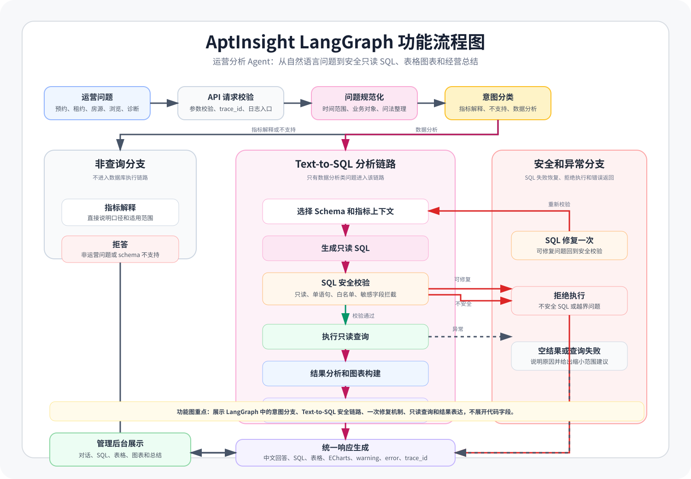

# Apartment Intelligence Platform

> 公寓租赁业务系统、管理后台、租客 H5、租客侧找房 Agent 和运营侧分析 Agent 的一体化工程。

`apartment-intelligence-platform` 不是单一的租房 CRUD 项目，而是围绕真实公寓租赁链路构建的多子系统平台。它用 `lease` 承载核心业务事实，用 `rentHouseAdmin` 和 `rentHouseH5` 承载管理端与租客端体验，并在两条业务路径中接入 AI Agent：

- `AptGuide 3.0`：面向租客的智能找房助手，负责自然语言找房、规则问答、预约确认、租约查询和工具调用。
- `AptInsight`：面向运营人员的智能分析助手，负责自然语言经营分析、Text-to-SQL、SQL 安全守卫、图表和业务总结。

## 系统架构

平台整体采用“业务系统为事实源、AI Agent 为智能编排层、前端只通过业务网关接入”的边界设计。


| 层级 | 子系统 | 使用对象 | 核心职责 |
| --- | --- | --- | --- |
| 租赁业务中心 | `lease/web-admin` | 管理员 / 运营 | 公寓、房间、属性、预约、租约、用户、岗位等后台 API |
| 租客业务网关 | `lease/web-app` | 租客 / H5 / AI 工具 | 租客登录、找房、预约、租约、浏览历史、AI 转发与内部工具接口 |
| 管理后台 | `rentHouseAdmin` | 管理员 / 运营 | 后台工作台、房源管理、租约管理、权限菜单、表格与表单维护 |
| 租客 H5 | `rentHouseH5` | 租客 | 找房、房源详情、预约看房、我的租约、浏览历史、AI 助手入口 |
| 租客侧 Agent | `AptGuide 3.0` | 租客 | 找房推荐、规则问答、预约确认、租约查询、长期偏好记忆 |
| 运营侧 Agent | `AptInsight` | 运营 / 管理员 | 自然语言数据分析、只读 SQL、表格图表、经营诊断 |

### 数据与调用边界

```text
租客
  -> rentHouseH5 / AiAssistant
  -> lease web-app /app/ai/chat
  -> AptGuide 3.0 /api/chat
      -> lease internal tools
      -> Milvus
      -> Agent state DB / Redis
      -> LLM
```

```text
运营人员
  -> rentHouseAdmin / 智能运营分析
  -> lease web-admin /admin/ai/chat
  -> AptInsight /api/chat
      -> SQL Guard
      -> MySQL 只读查询
      -> 表格 / 图表 / 总结
```

核心边界：

- `lease` 是业务事实源，拥有用户、房源、公寓、预约、租约、合同和敏感数据。
- `AptGuide 3.0` 拥有 Agent 会话、消息、待确认动作、记忆、人工转接、诊断和审计状态。
- `AptInsight` 不执行任何写操作，只通过安全校验后的只读 SQL 分析业务数据。
- 前端不直连 AI 内部依赖，不直接访问 LLM、Milvus、Redis 或 Agent 私有状态。

## AptGuide 3.0

`AptGuide 3.0` 是租客侧智能找房助手。它以独立服务形式开发和验证，最终通过 `rentHouseH5 -> lease web-app -> AptGuide 3.0` 的链路接入主系统。

### 系统定位


`AptGuide 3.0` 不直接信任前端传入的用户身份，也不直接持有业务事实。集成模式下，`lease web-app` 先完成 JWT 鉴权，再把可信用户身份和内部 token 注入请求头，AptGuide 只使用这些可信上下文调用内部工具。

主要能力：

- LLM-first 结构化理解：识别找房、规则问答、预约、租约、记忆、人工转接等意图。
- Room Search RAG：Query 改写、多查询向量召回、候选房源合并、身份映射、lease 校验、偏好评分和房源排序。
- KB QA RAG：租房规则知识库召回、片段重排、风险门控、来源卡片和基于证据的回答生成。
- 确认式写操作：预约创建 / 取消、记忆写入等操作先生成待确认状态，用户确认后才执行。
- 可观测与评测：trace 事件、LangSmith 可选追踪、RAG 诊断、Playwright E2E 和 live RAG eval。

### LangGraph 功能流程


这张图展示的是 Agent 内部功能流，而不是系统部署结构。它重点表达：

- 用户消息先经过会话加载、安全边界、LLM-first 理解和结构化校验。
- 低置信度、无效结构或意图不清时进入澄清节点。
- 非 RAG 任务进入预约、租约、记忆或人工转接等业务过程。
- 找房推荐和规则问答分别进入 `Room Search RAG` 与 `KB QA RAG` 子链路。
- 最终由 Response Composer 统一生成消息、卡片、动作、待确认状态和元数据。

## AptInsight

`AptInsight` 是运营侧智能分析助手。它面向公寓运营人员，把自然语言问题转为安全可控的只读 SQL，并返回表格、图表和业务总结。

### 系统定位



第一阶段，AptInsight 作为独立 FastAPI Agent 服务验证 Text-to-SQL、SQL 安全和经营分析能力。第二阶段，它通过 `rentHouseAdmin -> lease web-admin -> AptInsight` 集成到后台管理系统，由 Spring Boot 继续承担登录鉴权、统一响应和异常封装。

主要能力：

- 自然语言经营分析：支持预约、租约、房源、租金、浏览热度和经营诊断问题。
- LangGraph 工作流：问题规范化、意图分类、上下文选择、SQL 生成、安全校验、查询执行、图表构建和总结生成。
- sqlglot SQL Guard：只允许安全只读查询，拦截多语句、系统库、敏感字段和越权表。
- 只读数据库执行：使用只读 MySQL 账号，控制查询超时和最大返回行数。
- 评测闭环：Agent Eval Harness 覆盖 SQL 准确性、安全用例、边界情况和业务分析问题。

### LangGraph 功能流程



这张图展示的是 Text-to-SQL Agent 的功能流：

- 指标解释类问题不查库，直接回答口径。
- 不支持的问题明确拒答，避免编造数据库不存在的信息。
- 数据分析问题进入 Schema / 指标上下文选择、SQL 生成、SQL Guard 和只读查询链路。
- 可修复 SQL 只修复一次并重新校验，不安全 SQL 永不执行。
- 安全查询结果会继续生成表格、ECharts 图表、中文业务总结、warning、error 和 trace_id。

## lease

`lease` 是平台的数据和业务中心，采用 Spring Boot 3 + Java 17 + Maven 多模块结构。

```text
lease/
├── common/      # JWT、Redis、MinIO、验证码、短信、Web 基础能力
├── model/       # 实体、枚举、基础模型
└── web/
    ├── web-admin/  # 后台管理服务，/admin/*
    └── web-app/    # 租客端服务，/app/* 与 /internal/ai/tools/*
```

后台管理端覆盖公寓、房间、属性、费用、配套、标签、预约、租约、用户和岗位管理。租客端覆盖短信登录、找房、房源详情、预约看房、我的租约、浏览历史和 AI 聊天入口。

AI 相关边界：

- `web-app /app/ai/chat` 是租客侧 AI 的统一入口。
- `/internal/ai/tools/*` 是 AptGuide 3.0 调用业务事实和写操作的内部工具接口。
- `web-admin /admin/ai/chat` 可作为 AptInsight 集成阶段的后台 AI 网关。

## 前端应用

### rentHouseAdmin

后台前端采用 Vue3 + Vite + TypeScript + Pinia + Element Plus + ECharts。它面向运营和管理员，适合高频表格、筛选、表单、上传、权限菜单和主题切换等后台工作流。

已覆盖页面包括：

- 首页工作台。
- 系统用户管理、岗位管理。
- 公寓管理、房间管理、属性管理。
- 看房预约管理、租约管理。
- 租客用户管理。
- AptInsight 集成阶段的智能运营分析页面入口。

### rentHouseH5

租客 H5 采用 Vue3 + Vite + TypeScript + Pinia + Vant。它围绕租客找房链路组织页面和组件：

- 找房搜索、筛选、房源 / 公寓卡片。
- 房源详情、公寓详情、预约看房。
- 我的房间、我的租约、我的预约、浏览历史。
- 消息、圈子、个人中心。
- `AiAssistant` 和 `ChatMessage` 组件，通过 `src/api/ai` 接入 `/app/ai/chat`。

## 项目结构

```text
.
├── AptGuide 3.0/             # 当前重点：租客侧 LLM-first 找房 Agent
├── AptInsight/               # 当前重点：运营侧 Text-to-SQL 分析 Agent
├── AptGuide/                 # 历史 AptGuide 实现，保留作对照和资产来源
├── AptGuide 2.0/             # 历史升级版本，保留评测和迁移经验
├── docs/                     # 平台级文档入口和跨项目资产
├── lease/                    # Spring Boot 租赁业务后端
├── rentHouseAdmin/           # Vue3 后台管理系统
├── rentHouseH5/              # Vue3 租客移动端 H5
├── 参考资料/                 # 微信租房消息、简历、面试资料等参考材料
└── README.md
```

## 环境要求

| 类型 | 要求 |
| --- | --- |
| Java | JDK 17+ |
| Maven | 3.8+ |
| Node.js | 16+ |
| Python | 3.12+ |
| Python 包管理 | `uv` |
| 数据库 | MySQL 8.x |
| 缓存 | Redis |
| 对象存储 | MinIO |
| 向量检索 | Milvus 2.4+ |
| 模型服务 | OpenAI-compatible LLM / Embedding 服务 |

## Docker 一键部署

仓库已经提供 Docker Compose 形式的集成环境启动入口，适合快速拉起基础设施和主要后端链路做联调、验收或演示。

### 一键启动集成环境

```bash
cd /home/chove/桌面/apartment-intelligence-platform
docker-compose -f docker-compose.test.yml up -d
```

该 compose 文件覆盖：

- MySQL 8.0
- Redis 7
- etcd + MinIO + Milvus 2.4
- `lease-web-app`
- `aptguide` AI 服务镜像

停止环境：

```bash
docker-compose -f docker-compose.test.yml down
```

注意：`docker-compose.test.yml` 使用预构建镜像：

- `apartment-intelligence-platform-lease-web-app:latest`
- `apartment-intelligence-platform-aptguide:latest`

如果本机没有这些镜像，需要先按 [Docker 基础设施文档](docs/docker/infrastructure.md) 构建或准备镜像后再启动。

### AptGuide 3.0 本地基础设施

`AptGuide 3.0/backend` 还提供了轻量本地基础设施 compose，只启动 MySQL 和 Redis，适合开发 AptGuide 3.0 后端时使用：

```bash
cd "AptGuide 3.0/backend"
docker-compose -f docker-compose.local.yml up -d
```

停止：

```bash
docker-compose -f docker-compose.local.yml down
```

### AptInsight Docker 状态

`AptInsight` 文档中已经规划了 Dockerfile、Docker Compose 和后续部署方案，但当前仓库内没有实际的 `AptInsight/Dockerfile` 或 `AptInsight/docker-compose.yml`。因此 AptInsight 当前仍以 `uv` / `make run` 作为本地启动方式，Docker 化属于集成和企业化阶段的后续补齐项。

更多 Docker 说明见：

- [Docker 启动文档](docs/docker/README.md)
- [基础设施服务启动指南](docs/docker/infrastructure.md)
- [应用服务启动指南](docs/docker/services.md)
- [Docker 常见问题排查](docs/docker/troubleshooting.md)

## 快速启动

### 1. 启动后台管理 API

```bash
cd lease
mvn clean install
mvn -pl web/web-admin spring-boot:run
```

默认端口：`http://localhost:8080`

### 2. 启动租客端 API

```bash
cd lease
mvn -pl web/web-app spring-boot:run
```

默认端口：`http://localhost:8081`

AI 转发相关环境变量：

```bash
APTGUIDE_URL=http://localhost:8100
AI_INTERNAL_TOKEN=aptguide-internal-token-2026
```

### 3. 启动管理后台

```bash
cd rentHouseAdmin
npm install
npm run dev
```

### 4. 启动租客 H5

```bash
cd rentHouseH5
npm install
npm run dev
```

### 5. 启动 AptGuide 3.0

```bash
cd "AptGuide 3.0/backend"
uv sync
cp .env.example .env
uv run uvicorn aptguide3.api.app:create_app --factory --reload --port 8100
```

默认端口：`http://localhost:8100`

### 6. 启动 AptInsight

```bash
cd AptInsight
uv sync
cp .env.example .env
make run
```

默认端口：`http://localhost:8000`

## 常用命令

| 模块 | 命令 | 说明 |
| --- | --- | --- |
| `lease` | `mvn clean install` | 编译 Java 多模块工程 |
| `lease/web-admin` | `mvn -pl web/web-admin spring-boot:run` | 启动后台 API |
| `lease/web-app` | `mvn -pl web/web-app spring-boot:run` | 启动租客端 API |
| `rentHouseAdmin` | `npm run dev` / `npm run build` | 启动或构建管理后台 |
| `rentHouseH5` | `npm run dev` / `npm run build` | 启动或构建租客 H5 |
| `AptGuide 3.0/backend` | `uv run pytest` / `uv run ruff check .` | 测试与代码检查 |
| `AptGuide 3.0/backend` | `uv run uvicorn aptguide3.api.app:create_app --factory --reload --port 8100` | 启动智能找房助手 |
| `AptInsight` | `make test` / `make lint` / `make eval` | 测试、检查与评测 |
| `AptInsight` | `make run` | 启动智能运营分析助手 |

## 数据与配置

仓库包含用于开发、联调和评测的数据资料：

- `AptInsight/scripts/seed_data_2025.sql`
- `AptInsight/scripts/seed_data_guangzhou_2026.sql`
- `AptInsight/backups/least_backup_20250502.sql`
- `参考资料/微信租房消息/`

本地联调时请重点确认：

- `web-admin` 和 `web-app` 连接的是同一个业务库。
- AptGuide 3.0 的 `lease_base_url`、`internal_token`、Milvus、Redis、LLM 和 Embedding 配置齐全。
- AptInsight 使用只读 MySQL 账号，不使用业务写账号。
- `.env`、短信密钥、LLM Key、数据库密码和 MinIO 密钥不要提交到仓库。

## 安全设计

- 管理端和租客端分别使用 `/admin/*` 与 `/app/*` API 边界。
- 租客个人数据必须按登录用户身份过滤，AptGuide 3.0 不信任前端传入的 `user_id`。
- AptGuide 3.0 的预约和记忆写操作必须经过待确认状态，用户确认后才执行。
- AptInsight 只允许 SELECT 查询，SQL 必须经过 AST 级安全校验。
- 敏感字段、系统库、多语句、DDL、DML 和越权表默认拒绝。
- MinIO、短信、LLM、数据库等密钥均通过环境变量提供。

## 文档索引

| 文档 | 说明 |
| --- | --- |
| [平台文档中心](docs/README.md) | 平台级文档入口和跨项目导航 |
| [AptGuide 3.0 README](AptGuide%203.0/README.md) | 租客侧 Agent 的定位、边界和当前状态 |
| [AptGuide 3.0 文档中心](AptGuide%203.0/docs/README.md) | 架构、计划、测试、成果文档入口 |
| [AptGuide 3.0 架构文档](AptGuide%203.0/docs/architecture.md) | Agent 层次、请求流、职责边界 |
| [AptInsight README](AptInsight/README.md) | 运营侧 Agent 的工程说明和开发命令 |
| [AptInsight 文档中心](AptInsight/AptInsight文档/README.md) | 产品、架构、Agent、接口、测试和集成文档 |
| [AptInsight 技术架构](AptInsight/AptInsight文档/03-技术架构与模块设计.md) | Text-to-SQL 服务、模块职责、安全设计 |
| [rentHouseAdmin README](rentHouseAdmin/README.md) | 管理后台说明 |
| [rentHouseH5 README](rentHouseH5/README.md) | 租客 H5 说明 |

## 当前状态

当前仓库已经具备“租赁业务系统 + 两端前端 + 双 Agent”的主体结构：

- `lease`、`rentHouseAdmin`、`rentHouseH5` 承载传统租赁业务链路。
- `AptGuide 3.0` 承载 C 端智能找房，并通过 `lease web-app` 内部工具接口与真实业务数据衔接。
- `AptInsight` 承载 B 端智能分析，并通过只读 SQL 安全链路分析租赁经营数据。
- 根 README 已将平台架构图、AptGuide 3.0 系统图、AptGuide 3.0 LangGraph 功能图、AptInsight 系统图和 AptInsight LangGraph 功能图集中展示。

后续重点通常是统一环境配置、补齐端到端联调脚本、接入后台 / H5 页面截图，并把 AI 评测纳入持续集成。
