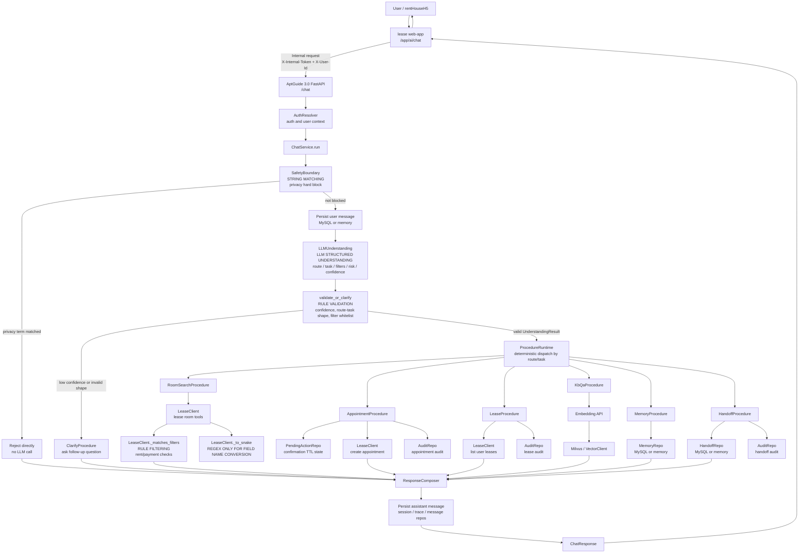

# AptGuide 3.0 System Flow: LLM and Rule Boundaries

This document shows the current AptGuide 3.0 request flow and marks where the system uses:

- LLM structured understanding
- deterministic string matching
- deterministic validation rules
- regular expressions

## Flow Diagram

## Boundary Notes

### LLM Usage

The LLM is used in `LLMUnderstanding` only. It converts the user's natural language message into a structured `UnderstandingResult`.

The expected output includes:

- `route`
- `task`
- `domain`
- `action`
- `hard_filters`
- `soft_preferences`
- `retrieval_queries`
- `risk`
- `confidence`

If the LLM is unavailable or the output is invalid, the system asks a clarification question. It does not fall back to keyword intent routing.

### String Matching

`SafetyBoundary` uses deterministic string matching before the LLM call. It checks hard privacy terms such as:

- `室友手机号`
- `别人手机号`
- `其他租户电话`
- `身份证`

If any term is present, the request is blocked before the LLM.

### Rule Validation

`validate_or_clarify` checks the LLM output shape. This is validation, not natural-language interpretation.

It checks:

- minimum confidence
- whether the model asked for clarification
- legal `route` and `task` combinations
- allowed `hard_filters` keys
- allowed enum values for payment type and room type

### Regular Expressions

The current regex usage is not for intent recognition. It is used in `LeaseClient._to_snake` to convert returned field names from `camelCase` to `snake_case`.

## Current Design Conclusion

AptGuide 3.0 is currently LLM-first for natural-language understanding. The code does not reuse AptGuide 2.0 style keyword routing or regex intent recognition. Deterministic code is used for safety blocking, schema validation, business dispatch, lease result filtering, persistence, and response composition.
